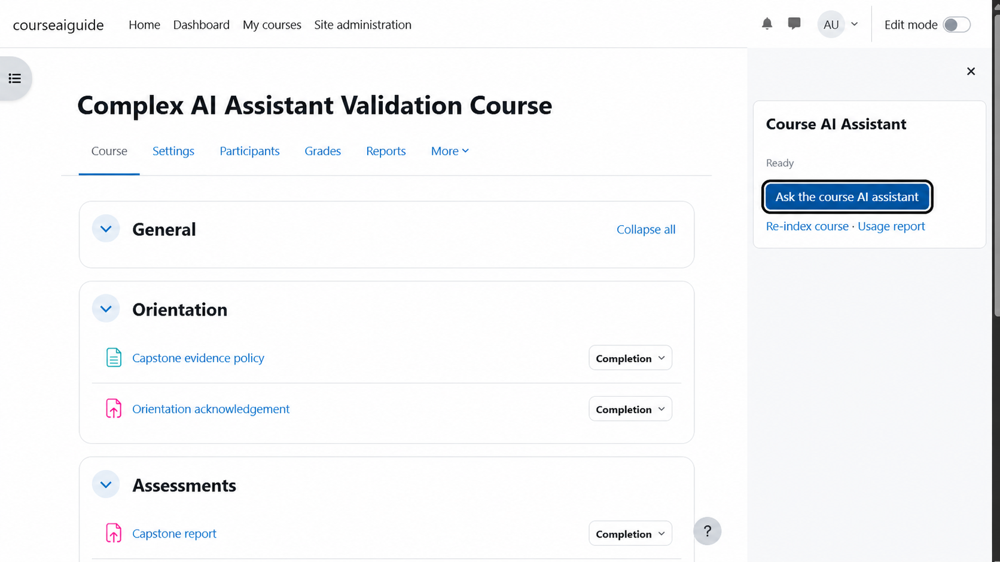
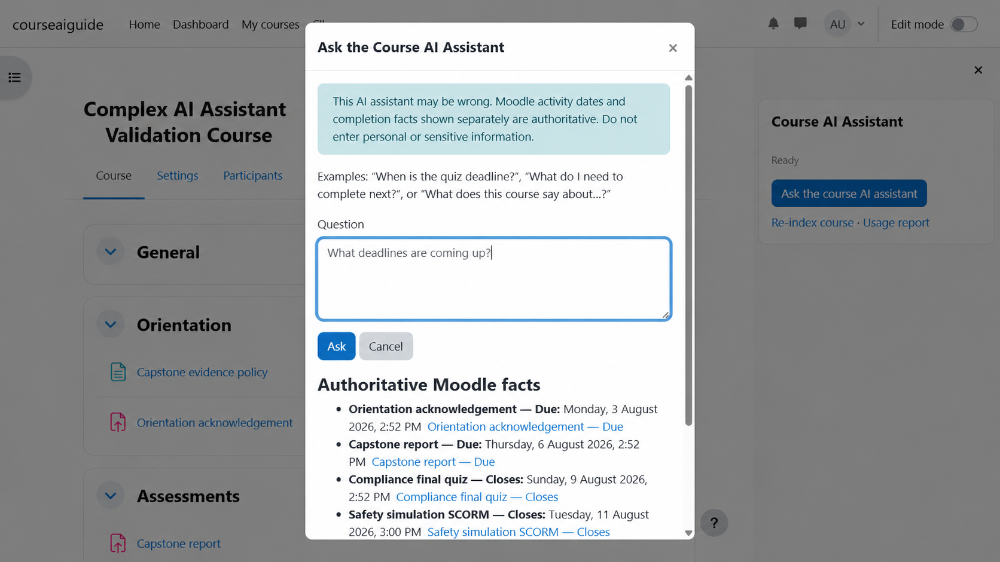
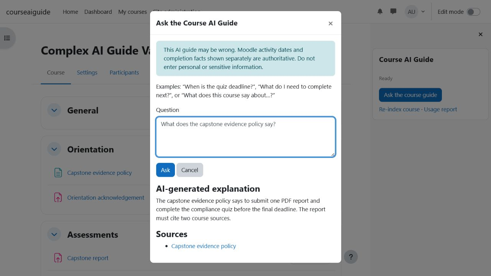

# Course AI Guide

Course AI Guide (`block_courseaiguide`) is a course-only Moodle block that combines authoritative, user-specific Moodle facts with access-filtered retrieval over approved course content. It can answer questions about deadlines, completion and permitted course materials without indexing quiz questions, submissions, grades or teacher-only files.

This is a beta release intended for review and controlled deployments. AI-generated explanations can be wrong; Moodle-rendered dates and completion facts are displayed separately as authoritative information.

## Features

- Deterministic answers for activity dates, course deadlines and the next incomplete activity.
- Database-backed lexical retrieval over explicitly enabled Moodle Search areas.
- Permission revalidation for every source before external transmission and citation display.
- Course, section, Page, Book, Book chapter, label, assignment description, quiz description and URL description sources.
- Accessible Mustache modal with a full-page non-JavaScript fallback.
- Optional participant-owned conversation history with administrator, course-manager and participant opt-in gates.
- Aggregate course/day usage reporting without questions, answers or user identifiers.
- Database-backed rate limiting, scheduled reconciliation and retention purging.

## Requirements

| Moodle | PHP |
| --- | --- |
| 4.5 LTS | 8.1–8.3 |
| 5.0 or 5.1 | 8.2–8.4 |
| 5.2 | 8.3–8.4 |

The plugin also requires:

- Moodle cron configured and running.
- An administrator-approved HTTPS OpenAI-compatible Chat Completions endpoint.
- A model identifier and API key for that provider.

There are no additional Moodle plugin or Composer dependencies. The external AI provider may require a paid account and charges are determined by that provider. The plugin does not include API credits.

## Installation

1. Download a release ZIP whose top-level directory is `courseaiguide`.
2. Install it through **Site administration → Plugins → Install plugins**, or extract it to:
   - `blocks/courseaiguide` for Moodle 4.5 and 5.0 source layouts;
   - `public/blocks/courseaiguide` for Moodle 5.1 and later source layouts.
3. Complete Moodle's standard plugin upgrade process.
4. Confirm that cron is running.

Do not install this plugin on Moodle 3.x.

## Administrator configuration

Open **Site administration → Plugins → Blocks → Course AI Guide** and configure:

- the complete HTTPS Chat Completions endpoint;
- the provider model identifier;
- the provider API key;
- the participant disclaimer;
- optional retention and aggregate-statistics settings;
- per-user/course request limits.

This release supports one site-wide OpenAI-compatible provider configuration. Multiple saved provider profiles, per-course provider selection and automatic provider fallback are not supported. To switch providers, a site administrator must replace the configured endpoint, model and API key.

The endpoint, model and key are unset by default. Retention is zero, statistics are disabled, and no course is participant-accessible by default.

The administrator is responsible for approving the AI provider, model, contract, data-processing terms, data residency, disclaimer and acceptable-use policy. Test model compatibility before enabling participant access.

## Course configuration

1. Add one **Course AI Guide** block to a course page.
2. Edit the block configuration.
3. Select the allowed source types and optionally add bounded course guidance.
4. Enable the course configuration and save it.
5. Run cron or wait for the queued indexing task.
6. Confirm the block displays **Ready**.
7. Enable participant access only after reviewing the indexed-content policy and test results.

Managers can manually queue a re-index from the block. Course changes also queue index maintenance, and scheduled reconciliation detects stale data.

## Data and privacy

For a textual question, the configured external provider may receive:

- the participant's plain-text question;
- bounded course guidance configured by a manager;
- user-specific Moodle facts relevant to the question;
- bounded excerpts from currently authorised course sources;
- opaque source identifiers and a non-sensitive request identifier.

The provider is not sent the Moodle user ID, API key, grades, submissions, attempts, quiz questions or answers. Provider-side processing and retention are controlled by the provider contract, not by this plugin.

Server-side conversation storage is disabled by default. A conversation is stored only when the site retention is 1–365 days, the course permits history, and the participant selects the save option. Otherwise each request is independent and the transcript remains only in the browser. The Moodle Privacy API supports metadata disclosure, export and deletion.

## Security model

Every request validates parameters, session key, course context, capabilities, active enrolment or management access, course readiness and rate limits. Retrieval is course-scoped. Every candidate is rechecked through its Moodle Search area's `check_access()` and current-user course-module visibility and availability before it can enter the provider prompt or citation list.

Provider redirects are disabled, response sizes are bounded, endpoint URLs are validated, model-generated URLs are discarded, and rendered model text is inserted as text rather than HTML. Raw prompts, responses, headers and keys are not logged.

Report suspected vulnerabilities privately as described in [SECURITY.md](SECURITY.md).

## Limitations

- Lexical retrieval can miss paraphrases, synonyms and some multilingual matches.
- AI-generated explanations may be incomplete or incorrect.
- SCORM package contents are not indexed; Moodle-provided SCORM dates can still be returned.
- Remote URL target content, arbitrary files and teacher-only files are not indexed.
- Quiz questions, answers, feedback, attempts, submissions and grades are excluded.
- The plugin provides a web interface and does not currently implement Moodle App-specific UI support.

## Screenshots

### Course-ready state

### Authoritative Moodle dates

### Source-grounded explanation

## Support and development

- Source: <https://github.com/tamaskery/moodle-chatbot>
- Issues: <https://github.com/tamaskery/moodle-chatbot/issues>
- Maintainer: Tamas Kery, <tom@tomkery.eu>
- Contribution guide: [CONTRIBUTING.md](CONTRIBUTING.md)
- Test instructions: [docs/TESTING.md](docs/TESTING.md)

When reporting a provider failure, include the non-sensitive request identifier and administrator diagnostic category. Never post API keys, raw prompts, course content or personal data.

## Licence

Copyright © 2026 Tamas Kery.

This plugin is licensed under the GNU General Public License, version 3 or later. See [LICENSE.md](LICENSE.md).
